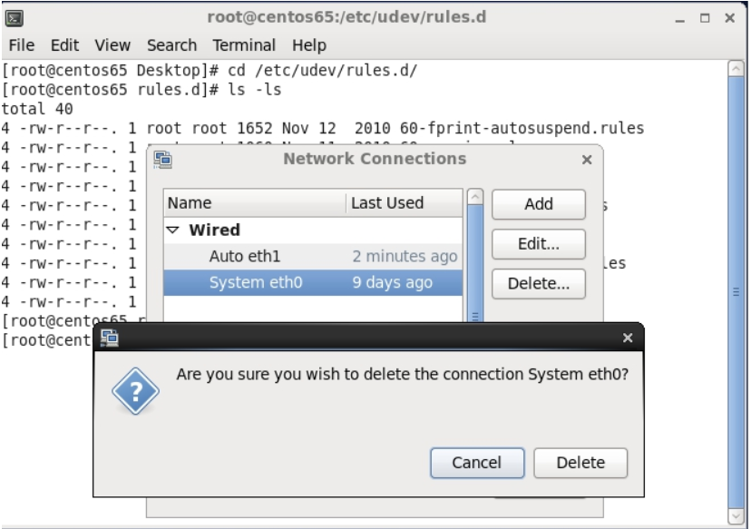
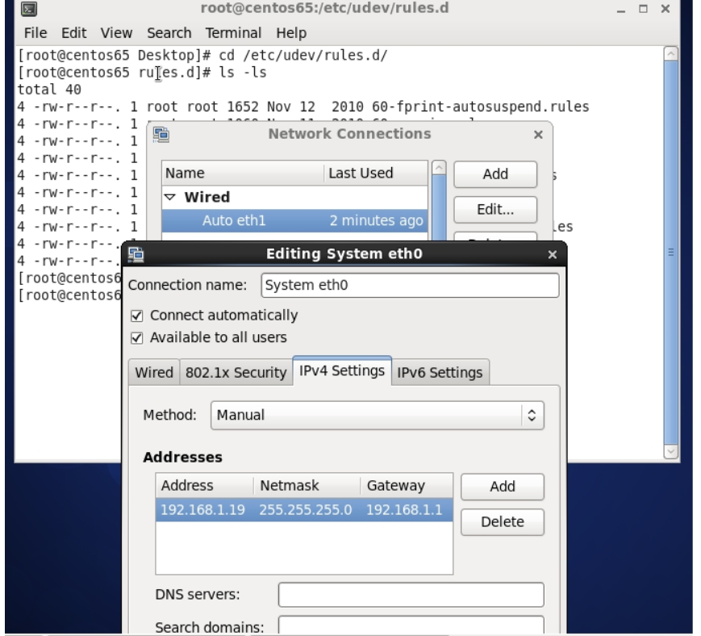

VIRTUALBOX虚拟机复制后配置
========
由于虚拟机的操作系统可能都是一样的，而创建一个虚拟机的时间比较长，故而会创建一个虚拟机；
其他虚拟机都是拷贝该虚拟机，后按照需求修改相关配置。
本文档的主要目的是解决一般复制后修改的两个配置；一是ip地址，二是主机名。
其他配置要根据具体要求来解决。

注：虚拟机复制要初始化网卡的MAC地址

#操作步骤

##启动复制后的虚拟机，进入到桌面操作系统

如果网络设置为多个，需要在启动前要设置桥接网络，主机网络，还是其他。

##修改IP地址

###cd /etc/udev/rules.d/

###vim 70-persistent-net.rules

文件内容出现eth0,eth1,注销eth0所在的行，将eth1修改为eth0

修改是要好好查看虚拟机设置下网络的mac地址是否匹配

###图像化界面

右击“两台电脑叠加在一起”的图标，选择“edit connection”,删除system eth0,将auth eth1 修改为System eth0,同时将网络地址配置完成

###cd /etc/sysconfig/network-scripts/

###mv ifcfg-System_eth0 ifcfg-eth0

##修改主机名
###vim /etc/sysconfig/network
hostname

现在重启一下虚拟机就可以正常连接了。
