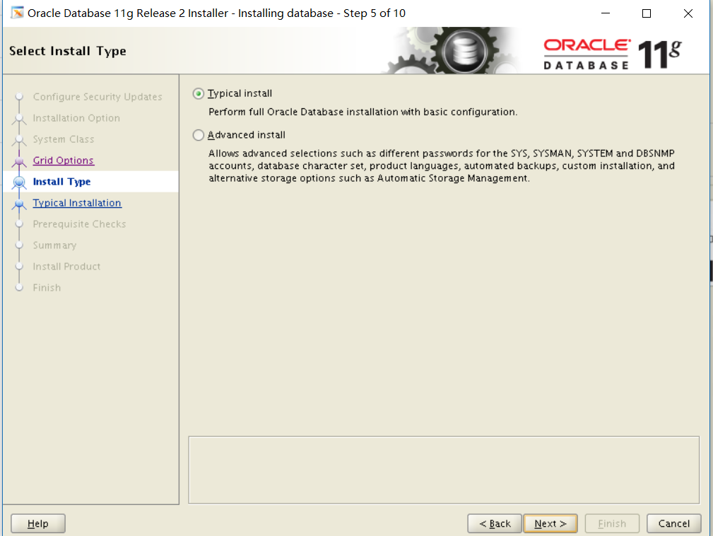
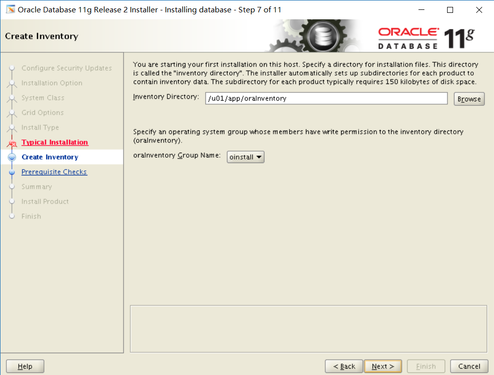

linux安装单机11g
========

oracle数据库单机需要整理出来一个文档，现在重新再虚拟机安装并且整理一个文档，需要后面在其他地方安装顺利

# 软件准备

*	centos6.5X64
*	linux.x64_11gR2_database_1of2.zip linux.x64_11gR2_database_1of2.zip

# 操作系统安装

略过

# 前期环境配置

## 防火墙检查关闭

	chkconfig iptables off
	chkconfig --list iptables

## 关闭selinux策略

	vim /etc/selinux/config

## 配置yum源

略过

## 创建依赖包安装文件，授权并执行

	cd /etc/yum.repos.d/
	vim pkg_run.sh

文件内容

yum -y install   binutils-2*x86_64*

yum -y install   glibc-2*x86_64* nss-softokn-freebl-3*x86_64*

yum -y install   glibc-2*i686* nss-softokn-freebl-3*i686*

yum -y install   compat-libstdc++-33*x86_64*

yum -y install   glibc-common-2*x86_64*

yum -y install   glibc-devel-2*x86_64*

yum -y install   glibc-devel-2*i686*

yum -y install   glibc-headers-2*x86_64*

yum -y install   elfutils-libelf-0*x86_64*

yum -y install   elfutils-libelf-devel-0*x86_64*

yum -y install   gcc-4*x86_64*

yum -y install   gcc-c++-4*x86_64*

yum -y install   ksh-*x86_64*

yum -y install   libaio-0*x86_64*

yum -y install   libaio-devel-0*x86_64*

yum -y install   libaio-0*i686*

yum -y install   libaio-devel-0*i686*

yum -y install   libgcc-4*x86_64*

yum -y install   libgcc-4*i686*

yum -y install   libstdc++-4*x86_64*

yum -y install   libstdc++-4*i686*

yum -y install   libstdc++-devel-4*x86_64*

yum -y install   make-3.81*x86_64*

yum -y install   numactl-devel-2*x86_64*

yum -y install   sysstat-9*x86_64*

yum -y install   compat-libstdc++-33*i686*

yum -y install   compat-libcap*

授权并执行

	chmod 777 pkg_run.sh
	./pkg_run.sh

## 创建用户并修改参数文件

	groupadd oinstall
	groupadd dba
	useradd -m -g oinstall -G dba oracle
	passwd oracle

	mkdir -p /u01/app/oracle
	chown -R oracle:oinstall /u01/app/oracle
	chmod -R 777 /u01/app/oracle
	mkdir -p /u01/app/oraInventory
	chown -R oracle:oinstall /u01/app/oraInventory
	chmod -R 777 /u01/app/oraInventory

	su - oracle
	vim .bash_profile

.bash_profile添加内容[oracle用户]

export ORACLE_SID=orcl

export ORACLE_BASE=/u01/app/oracle

export ORACLE_HOME=/u01/app/oracle/product/11.2.0/db_1

export PATH=$PATH:/u01/app/oracle/product/11.2.0/db_1/bin

## 配置其他参数

修改参数文件

	vim /etc/sysctl.conf 

检查是否有有下面信息；如果没有要添加

kernel.shmmni = 4096

kernel.sem = 250 32000 100 128

net.ipv4.ip_local_port_range = 9000 65500

net.core.rmem_default = 262144

net.core.rmem_max = 4194304

net.core.wmem_default = 262144

net.core.wmem_max = 1048586

fs.aio-max-nr = 1048576

fs.file-max = 6815744

修改完后执行

	/sbin/sysctl -p

修改参数文件

	vim /etc/security/limits.conf

检查是否有有下面信息；如果没有要添加

oracle soft nproc 2047

oracle hard nproc 16384

oracle soft nofile 1024

oracle hard nofile 65536

修改参数文件

	 vim /etc/pam.d/login

检查是否有有下面信息；如果没有要添加

session required /lib/security/pam_limits.so

## 重启

## 上传文件到/u01/app/oracle并解压

	unzip linux.x64_11gR2_database_1of2.zip 
	unzip linux.x64_11gR2_database_2of2.zip

## 安装xterm软件

	rpm -qa | grep xterm
	yum -y install xterm*

# 安装oracle软件

## 使用xstart软件登录到oracle用户

## 进入oracle解压目录并执行安装命令

	./runInstall

